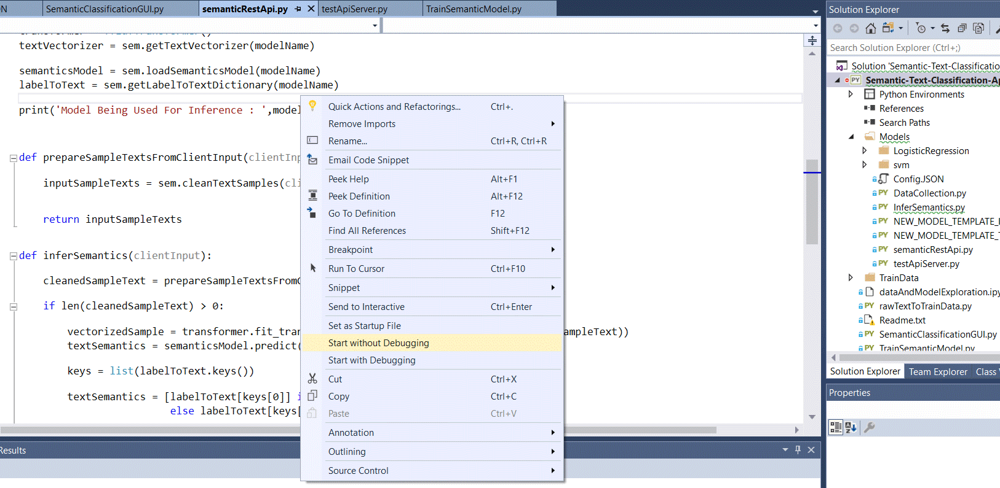

# Semantic-Text-Classification-AppleVsApple
This is semantics text classification with both client and server side scripts and a GUI for client to interact with the server.  
It has code for :  
1) Training and inference of models  
2) Collecting data of client requests and server response is a sqlite database  
Models directory has trained SVM for this task and one can easily integrate other models for training and inference with minimal changes to existing files.  
  
See help.txt for detialed explanation  

# Demo

# Dependencies
python 			3.5.6  
sklearn 		0.2.0  
pathlib			2.3.2  
os				any  
json			2.6.0  
argparse		any  
flask			1.0.2  
threading		any  
tkinter			8.6  
pickle			0.7.5  
sqlite3			3.24.0  
datetime		any  
nltk			3.3  